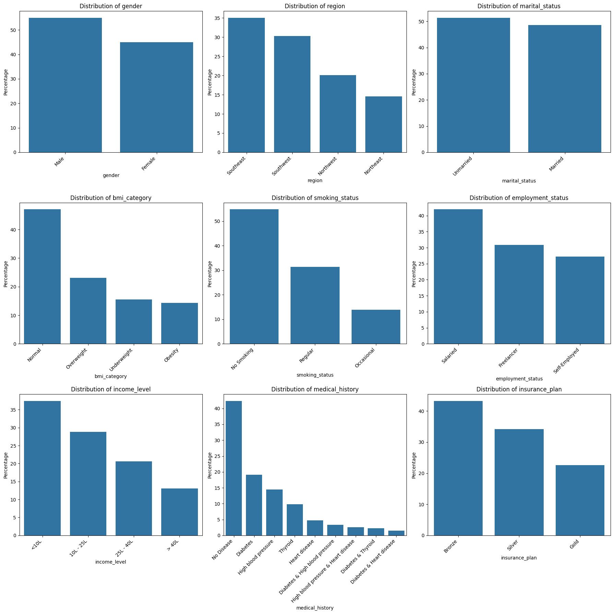

## Project Overview
This project develops a predictive model to estimate health care insurance premiums based on Age, BMI, Medical history and smoking habits. Here we will build and deploy predictive model using streamlit application.

## Objective
1. Develop high accuracy predictive model with accuracy more than 97%. Percentage difference between predicted value and actual value on a minimum of 95% errors should be less than 10%.
2. Deploy the model in cloud.
3. Create an interactive streamlit application.

## Data Collection, Cleaning and Exploratory Data Analysis (EDA)

We have data in xlsx format. To read the data from xlsx format we used pandas library `read_excel()`. To analyse data we want to look for number of columns and their value. That's why used `head()` function to display all columns and 5 rows.
```python
df = pd.read_excel("premiums.xlsx")
df.head()
```
|index|Age|Gender|Region|Marital\_status|Number Of Dependants|BMI\_Category|Smoking\_Status|Employment\_Status|Income\_Level|Income\_Lakhs|Medical History|Insurance\_Plan|Annual\_Premium\_Amount|
|---|---|---|---|---|---|---|---|---|---|---|---|---|---|
|0|26|Male|Northwest|Unmarried|0|Normal|No Smoking|Salaried|\<10L|6|Diabetes|Bronze|9053|
|1|29|Female|Southeast|Married|2|Obesity|Regular|Salaried|\<10L|6|Diabetes|Bronze|16339|
|2|49|Female|Northeast|Married|2|Normal|No Smoking|Self-Employed|10L - 25L|20|High blood pressure|Silver|18164|
|3|30|Female|Southeast|Married|3|Normal|No Smoking|Salaried|\> 40L|77|No Disease|Gold|20303|
|4|18|Male|Northeast|Unmarried|0|Overweight|Regular|Self-Employed|\> 40L|99|High blood pressure|Silver|13365|

The names for columns are not consistent. We will use snake case convention. So we will convert all column names into consistent naming. 
```python
df.columns = df.columns.str.replace(" ", "_").str.lower()
```
This command will replace space " " with underscore "_". Also it will convert all letters into lower case. Now all columns are consistent.

We will check NA/NULL/null values in our dataset
```python
df.isnull().sum()
```
This will provide NA statistics for each columns of data frame.

We will drop na values as our whole data size is of 50000 records out of which maximum 15 rows have na value. So in this case we will remove those data. ```dropna()``` function will be used to drop all na values in the dataframe. Based on different requirement we can use mean, median, mode as well.
```python
df = df.dropna()
```

To check duplicated rows 
```python
df = df.duplicated.sum()
df = df.drop_duplicates()
```
To get quick statistics for our data frame
```python
df.describe()
```
|index|age|number\_of\_dependants|income\_lakhs|annual\_premium\_amount|
|---|---|---|---|---|
|count|49976\.0|49976\.0|49976\.0|49976\.0|
|mean|34\.59176404674243|1\.711841684008324|23\.021150152072995|15766\.810188890668|
|std|15\.000377630784854|1\.4981945585589727|24\.221794329612134|8419\.995270538298|
|min|18\.0|-3\.0|1\.0|3501\.0|
|25%|22\.0|0\.0|7\.0|8607\.75|
|50%|31\.0|2\.0|17\.0|13928\.0|
|75%|45\.0|3\.0|31\.0|22273\.5|
|max|356\.0|5\.0|930\.0|43471\.0|

### Numeric data Analysis 
Based on statistics we can alnalyse that we have outliers. Maximum value for Age is 350 which is an outlier. In number of dependents th minmum value is -3 which is incorrect data. In income lakhs maximum value is 930 Lakhs with mean value as 23 Lakh. So this is an outlier

#### Number of Dependents
To check number of rows with negative value and unique value
```python
df[df.number_of_dependants < 0].shape
df[df.number_of_dependants < 0]['number_of_dependants'].unique()
```
Here we are taking an assumption that negative values for number of dependents can be an error. As there are 72 rows with negative value dropping these rows are not adivsable. We are replacing negative values with positive values as its not possible for number of dependents to be negaive.
```python
df['number_of_dependants'] = df['number_of_dependants'].abs()
```
#### Age
This column have outliers. To visulaize outliers box plot is preffered. 
```python
sns.boxplot(x = df['age'])
plt.show()
```


To Display box plot for all numeric columns 
```python
numeric_columns = df.select_dtypes(['float64', 'int64']).columns
for col in numeric_columns:
  sns.boxplot(x = df[col])
  plt.show()
```
Based on box plot age above 100 is outlier
```python
df = df[df.age < 100].copy()
```
#### Income Lakhs
The Interquartile Range (IQR) method is a common statistical technique to detect and remove outliers from a dataset.
Calculate the 1st Quartile (Q1) — 25th percentile
Calculate the 3rd Quartile (Q3) — 75th percentile

Compute the IQR: IQR=Q3−Q1
Determine the outlier bounds:

Lower Bound = Q1−1.5×IQR
Upper Bound = Q3+1.5×IQR
Values below the lower bound or above the upper bound are outliers.
```python
def get_iqr_bounds(col):
  Q1, Q3 = col.quantile([0.25, 0.75])
  IQR = Q3-Q1
  lower_bound = Q1 - 1.5*IQR
  upper_bound = Q3 + 1.5*IQR
  return lower_bound, upper_bound
get_iqr_bounds(df.income_lakhs)
```
Other way to find outliers is by using quantile
```python
df.income_lakhs.quantile([0.25, 0.75])
df.income_lakhs.quantile(.999)
df = df[df.income_lakhs < 100]
```
We will plot distribution using histogram for all numeric columns for analysis. This will give us understanding what type of data we have like right skewed, left skewed, normal distribution, uniform distriburtion etc.
We have four numeric data Age, number of dependents, income lakhs, annual premium amount. We can display histogram of all four columns in 2x2 format. 
We will create 4 sub plots ```plt.subplots(()``` with 2 rows and 2 columns ```nrows=2, ncols=2```. We will have figure size 12inches as width and 8 inches as height ```figsize()```. ```fig``` is entire figure and ```axes``` is 2x2 array of individual figure
```python
fig, axes = plt.subplots(nrows=2, ncols=2, figsize=(12, 8))  # 2 rows × 2 columns
```
```flatten()``` converts 2D array to 1D array. This makes it easier to loop through with ```axes[i]```
```python
axes = axes.flatten()
```
For looping through 4 columns we use ```enumerate()```. It gives both index and columns name
```python
for i, col in enumerate(numeric_columns[:4]):
```

We used seaborn ```histplot()``` for plotting histogram. ```kde=True``` adds kernel density estimate over histogram. ```ax=axes[i]``` draws the plot in correct subplot. To prevent label/title overlap ```tight_layout()``` is used.
```python
sns.histplot(x=df[col], kde=True, ax=axes[i])
plt.tight_layout()
```


Age, income lakhs and annual premium amount are right skewed distribution. 

#### Bi-variant Analysis
```python
sns.scatterplot(df, x = 'age', y = 'annual_premium_amount')
plt.show()
```


As age increases your annual premium amount increases.

### Categorical data Analysis 

```python
categorical_columns = ['gender', 'region', 'marital_status', 'bmi_category', 'smoking_status', 'employment_status', 'income_level', 'medical_history']
for col in categorical_columns:
  print(col, ":", df[col].unique())
```
To check uniquness of categorical data. Based on analysis smoking_status data has some variation

```python
df['smoking_status'] = df['smoking_status'].replace(
    {'Smoking=0': 'No Smoking', 'Does Not Smoke': 'No Smoking', 'Not Smoking': "No Smoking"}
)
```

To check the percentage of non-categorical data
```python
percentage_count = df['gender'].value_counts(normalize = True)
```

```percentage_count.index``` will give the index of gender as ```male or female```
```percentage_count.values``` will give values of particular index

For EDA we will plot bar graphs for all categorical data to visualize it.
```python
fig, axes = plt.subplots(3, 3, figsize=(18, 18))
axes = axes.flatten()

for ax, column in zip(axes, categorical_columns):
    categorical_count = df[column].value_counts(normalize=True) * 100
    sns.barplot(x=categorical_count.index, y=categorical_count.values, ax=ax)
    ax.set_title(f'Distribution of {column}')
    ax.set_ylabel('Percentage')
    ax.set_xlabel(column)

    # Rotate labels and align from left
    for label in ax.get_xticklabels():
        label.set_rotation(45)
        label.set_ha('right')  # or 'left' or 'center', depending on your preference

plt.tight_layout()
plt.show()
```





